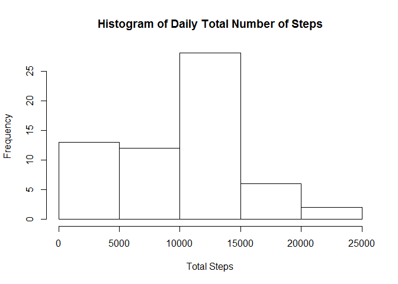
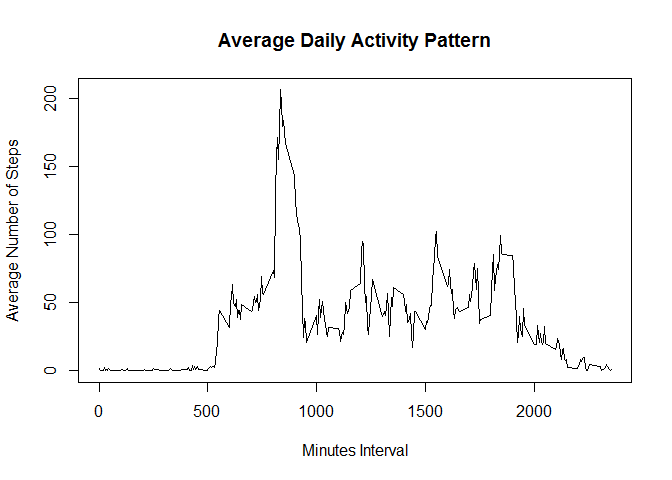
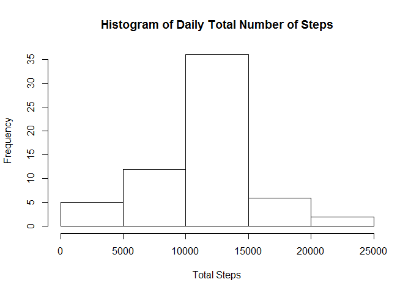
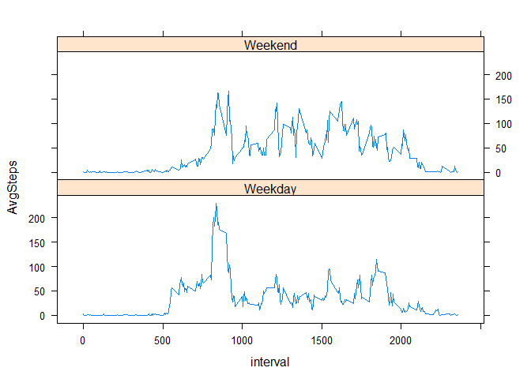

# Reproducible Research: Peer Assessment 1

## Loading and preprocessing the data

```r
# Read the data in activity.zip and store it into a data frame
MyDataFrame <- read.csv(unz("activity.zip", "activity.csv"), na.strings = "NA", header=TRUE, sep=",", stringsAsFactors = FALSE)
# Convert the date column into a Date format
MyDataFrame$date <- as.Date.character(MyDataFrame$date, format="%Y-%m-%d")
# Transform the interval to represent the minutes rather than a combination of hour and minutes
#MyDataFrame$interval <- (floor(MyDataFrame$interval/100) * 60) + (MyDataFrame$interval - (floor(MyDataFrame$interval/100) * 100))
```

## What is mean total number of steps taken per day?

```r
## Install dplyr package when it is not already insalled
if (!"dplyr" %in% rownames(installed.packages())){
  install.packages("dplyr")
}
## Load the dplyr package
library(dplyr)
```

```
## Warning: package 'dplyr' was built under R version 3.1.3
```

```
## 
## Attaching package: 'dplyr'
## 
## The following object is masked from 'package:stats':
## 
##     filter
## 
## The following objects are masked from 'package:base':
## 
##     intersect, setdiff, setequal, union
```

```r
## Summarize the total number of steps taken each day, excluding NA values
TotStepsPerDay <- summarise(group_by(MyDataFrame, date), TotSteps = sum(steps, na.rm=TRUE))
## Draw the histogram of daily total number of steps taken
hist(TotStepsPerDay$TotSteps, main="Histogram of Daily Total Number of Steps", xlab="Total Steps")
```

 

#### The mean of the total number of steps taken per day is:

```r
## Calculate the average of the daily total number of steps
OriginalMeanSteps <- mean(TotStepsPerDay$TotSteps)
print(OriginalMeanSteps)
```

```
## [1] 9354.23
```

#### The median of the total number of steps taken per day is:

```r
## Calculate the median of the daily total number of steps
OriginalMedianSteps <- median(TotStepsPerDay$TotSteps)
print(OriginalMedianSteps)
```

```
## [1] 10395
```

## What is the average daily activity pattern?

```r
## Summarize the average number of steps for each minutes interval, excluding NA values
AvgStepsEachInterval <- summarize(group_by(MyDataFrame, interval), AvgSteps = mean(steps, na.rm=TRUE))
## Draw a line series plot for the average daily activity pattern
plot(x=AvgStepsEachInterval$interval, y=AvgStepsEachInterval$AvgSteps, type="l", main="Average Daily Activity Pattern", xlab="Minutes Interval", ylab="Average Number of Steps")
```

 

#### The 5-minute interval that contains the most number of steps is:

```r
## Find the minutes interval where the average steps is the maximum
filter(AvgStepsEachInterval, AvgSteps == max(AvgSteps))$interval
```

```
## [1] 835
```

## Imputing missing values
#### The total number of rows with NA values is:

```r
## Find the rows that contains NA
ContainsMissing <- filter(MyDataFrame, is.na(interval) | is.na(date) | is.na(steps))
## Calculate the total number of rows with NA value
nrow(ContainsMissing)
```

```
## [1] 2304
```
#### Filling in the NA values in steps with the mean of steps for that 5-minutes interval (rounded to the nearest integer)

```r
# Copy the data set into a new data set
MyNoMissDF <- MyDataFrame
for (i in 1:nrow(MyNoMissDF)){
  if (is.na(MyNoMissDF$steps[i])){
    MyNoMissDF$steps[i] <- as.integer(round(AvgStepsEachInterval$AvgSteps[AvgStepsEachInterval$interval == MyNoMissDF$interval[i]]))
  }
}
```

#### Generate the histogram of the average number of steps taken per day after filling in the NA

```r
## Summarize the total number of steps taken each day on the new data set
NewTotStepsPerDay <- summarise(group_by(MyNoMissDF, date), TotSteps = sum(steps))
## Draw the histogram of daily total number of steps taken
hist(NewTotStepsPerDay$TotSteps, main="Histogram of Daily Total Number of Steps", xlab="Total Steps")
```

 

#### The new mean value of the total number of steps taken per day is:

```r
## Calculate the new average of the daily total number of steps
NewMeanSteps <- mean(NewTotStepsPerDay$TotSteps)
print(NewMeanSteps)
```

```
## [1] 10765.64
```

#### The new median value of the total number of steps taken per day is:

```r
## Calculate the new median of the daily total number of steps
NewMedianSteps <- median(NewTotStepsPerDay$TotSteps)
print(NewMedianSteps)
```

```
## [1] 10762
```

#### The mean and/or median value after inserting the NA values are:

```r
## Compare the new mean and median value with the previous values and print the message
if (OriginalMeanSteps == NewMeanSteps){
  print("Same mean value.")
}else{
  if (NewMeanSteps > OriginalMeanSteps)
    print("Different and larger mean value.")
  else
    print("Different and smaller mean value.")
}
```

```
## [1] "Different and larger mean value."
```

```r
if (OriginalMedianSteps == NewMedianSteps){
  print("Same median value.")
}else{
  if(NewMedianSteps > OriginalMedianSteps)
    print("Different and larger median value.")
  else
    print("Different and smaller median value.")
}
```

```
## [1] "Different and larger median value."
```

#### The impact of inputting missing data is making the estimate of the total daily number of steps:

```r
## Compare the new average daily number of steps, compare it with the previous value, and print the message
if (OriginalMeanSteps == NewMeanSteps){
  print("Unchanged.")
}else{
  if (NewMeanSteps > OriginalMeanSteps)
    print("Larger.")
  else
    print("Smaller.")
}
```

```
## [1] "Larger."
```

## Are there differences in activity patterns between weekdays and weekends?

```r
## Insert a new column of factor variable to indicate whether the day is a weekend
MyDayType <- weekdays(MyNoMissDF$date)
MyDayType <- sapply(MyDayType, function(x) if (x %in% c("Saturday", "Sunday")) as.factor("Weekend") else as.factor("Weekday"))
MyNoMissDF <- mutate(MyNoMissDF, DayType = MyDayType)

## Extract the data corresponding to the weekday and weekend respectively
WeekdayData <- filter(MyNoMissDF, DayType == "Weekday")
WeekendData <- filter(MyNoMissDF, DayType == "Weekend")

## Summarize the average number of steps for weekday and weekend dates
AvgStepsWeekday <- summarize(group_by(WeekdayData, interval), AvgSteps = mean(steps))
AvgStepsWeekend <- summarize(group_by(WeekendData, interval), AvgSteps = mean(steps))
```


```r
## Draw the 
par(mfrow=c(2,1))
plot(x=AvgStepsWeekend$interval, y=AvgStepsWeekend$AvgSteps, type="l", main="Weekend", xlab="Interval", ylab="Number of steps")
plot(x=AvgStepsWeekday$interval, y=AvgStepsWeekday$AvgSteps, type="l", main="Weekday", xlab="Interval", ylab="Number of steps")
```

 
